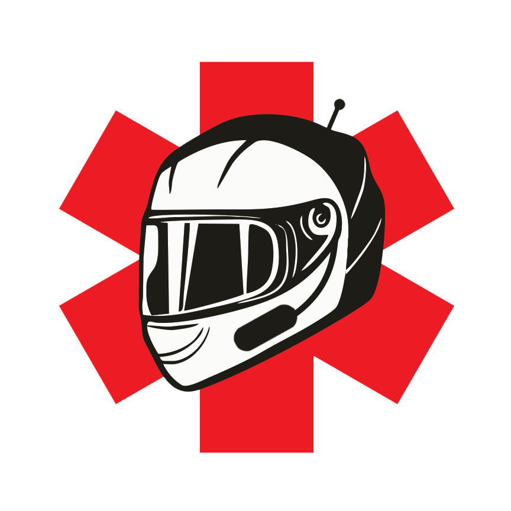

# Moto Health Emergency Bot

    

### Mission

Telegram bot developed for volunteer organization "Moto Health Odessa". 

Through carefully designed dialog with quick answers users can report car/bike accident to the bot and it would be fault-tolerantly broadcasted to all chats the bot was wired-up to (using built-in secured administrative functions). App extensively uses telemetry to allow organization to analyze usage patterns and continuously improve the flow.

### Tech Stack

* Bot itself is implemented with **ASP.NET Core** using middleware approach to build resilient Telegram web hook processing pipeline. Hosted on **Azure App Service** 
* Report processing is implemented with **Azure Durable Functions** app that receives report from bot app through **Azure Storage Queue** message and resiliently processes it.
* Custom Telegram client library (`MotoHealth.Telegram` project) is implemented based on awesome `Telegram.Bot` [NuGet](https://www.nuget.org/packages/Telegram.Bot/). Providing integration with `IHttpClientFactory`, retry-policy and fluent Telegram message builder.
* **Azure Tables** NoSQL storage is used for persistence layer.
* **Azure App Insights** is extensively used for app telemetry collection from CPU / Memory usage to app flow events.
* Whole product infrastructure is automated with **Azure Resource Manager (ARM)** template.
* **GitHub Actions** power CI / CD. Deploying beta and prod environments upon merges to `develop` and `main` branches respectively.